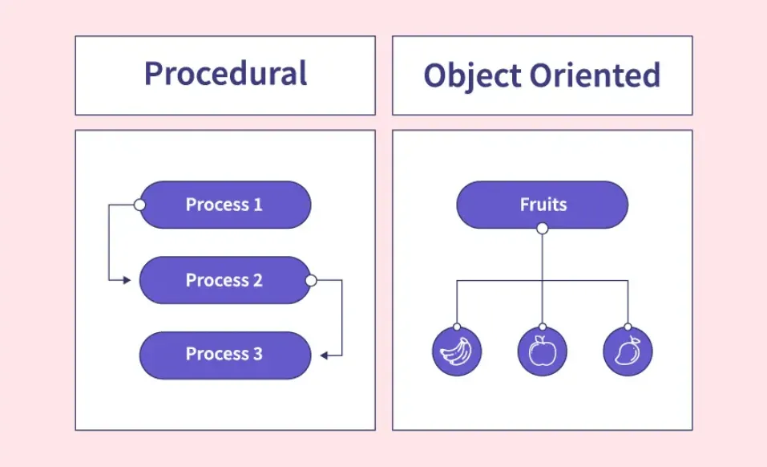

# MODUL - 1 : PENGANTAR PEMROGRAMAN BERORIENTASI OBJEK

>**Tujuan Pembelajaran** : 
Mahasiswa bisa membuat class sendiri, lalu membuat object darinya.

**Materi Pemberlajaran :** 
1. Paradigma OOP vs Prosedural
2. Class dan Object
3. Constructor `__init__()`
4. Class dan Instance Attribute
5. Method

**Capaian Pembelajaran :** 
1. Mahasiswa mampu menjelaskan perbedaan pemrograman prosedural dengan pemrograman berorientasi objek
2. Mahasiswa mampu menjelaskan dan membuat class dan object dalam python
3. Mahasiswa mampu menjelaskan dan membuat constructor dalam python
4. Mahasiswa mampu menjelaskan dan membuat class dan instance attribute dalam pythobn
5. Mahasiswa mampu menjelaskan dan membuat method dalam pyhton
   
---

## 1. Paradigma Pemrograman OOP dan Prosedural
Permograman berorientasi objek (seringkali disebut sebagai OOP), menjadikan** objek sebagai pusat dari konsep pemrogramannya**. Berbeda dari pemrograman prosedural yang menjadikan **fungsi-fungsi menjadi konsentrasi utamanya**. 

 sumber : [Object-Oriented Programming (OOP) and Procedural-Oriented Programming(POP): Two Paradigms, One Dilemma](https://medium.com/@kalyanasundaramthivaharan/object-oriented-programming-oop-and-procedural-oriented-programming-pop-two-paradigms-one-7a11cc143f0c)

Sederhananya pemrograman prosedural dibuat langkah demi langkah dengan fungsi/prosedur, dan fokus pada bagaimana urutan kerjanya. Sementara OOP (*Object Oriented Programming*), program dibuat dengan **object** yang mempunyai data (**attribute**), perilaku (**method**), dan fokus pada "***siapa aktornya***" atau objek. 

**Pertanyaan Sederhana :**

>Menurutmu, kalau kita ingin membuat **program untuk sistem kampus**, lebih cocok pakai prosedural atau OOP? Kenapa?

---

## 2. Class dan Object 
**Class** paling mudah dianalogikan sebagai cetak biru (*blueprint*) atau resep. 
- Class **bukanlah benda nyata**, sehingga kita tidak mungkin mengendarai cetak biru dari mobil misalnya
- Class **mendefinisikan ciri atau karakteristik** atau sering disebut *attribut* dan perilaku atau sering disebut *method*

**Analoginya** : kita punya `class` bernama `Kucing`. Cetak biru yang menyatakan bahwa setiap kucing akan memiliki : 
- Ciri atau Karakteristik (*attribute*), contohnya `jenis`, `warna`, `umur`, `ras`, dan lainnya
- Perilaku (*method*), contohnya `mengeong()`, `tidur()`, `makan()`, `berjalan()`, dan lainnya. 

Yang perlu diingat class `Kucing` ini **hanyalah sebuah konsep atau entitas**, dan bukanlah objek kucing sebenarnya. 

**Pertanyaan Sederhana :**

>Pada game **Mobile Legend**, adakah yang bisa disebut sebagai `class`, jika ada apa yang menjadi `attribute` dan `method` dari class itu? 

---

**Object** adalah **wujud nyata** dari `class` (dibuat berdasarkan cetak biru class). Ini adalah hasil dari "pabrik" yang menggunakan `class` sebagai panduannya.

**Analogi**: Dari `Class Kucing` tadi, kita bisa membuat beberapa `object` kucing yang nyata:

- **Object 1**: Seekor kucing dengan `nama` Oyen, dengan `warna_bulu` 'Oranye', dan `umur` 2 tahun.

- **Object 2:** Seekor kucing dengan `nama` Milo, dengan `warna_bulu` 'Coklat', dan `umur` 3 tahun.

`Oyen` dan `Milo` adalah object atau instance dari `Class Kucing`. Keduanya punya atribut dan method yang sama (bisa mengeong, tidur, makan), tetapi dengan nilai atribut yang berbeda (nama dan warnanya beda).

**Singkatnya**: `Class` adalah idenya, `Object` adalah perwujudannya.

**Pertanyaan Sederhana :**

>Jika sudah membuat `class` pada game **Mobile Legend**, selanjutnya sebutkan dua `object` yang bisa dibuat dari `class` tersebut!


### Praktikum 1 - Class dan Object

Membuat class dengan nama `Hero()`, kemudian membuat object (`hero_1`, dan `hero_2`) dari class, sekaligus memberikan nilai atribut pada object (`name` dan `power`). Diakhiri dengan menampilkan nilai atribut dari object 

```python
class Hero: 
    pass

hero_1 = Hero() 
hero_2 = Hero() 

hero_1.name = "Goku"
hero_2.name = "Vegeta"

hero_1.power = 100
hero_2.power = 90


print(hero_1.name)
print(hero_2.name)  
print(hero_1.__dict__) 

```
**Pertanyaan Praktikum :**

>Jelaskan fungsi dari setiap baris pada kode diatas, sekaligus jelaskan apa maksud dari perintah `.__dict__`!

---

## 3. Constructor `__init__()`
Constructor pada bahasa pemrograman python, merupakan `method` khusus yang berfungsi untuk memberikan nilai awal (instansiasi atribut) saat object diciptakan. Beberapa sifat dari constructor adalah : 
- memiliki nama method `__init__()`
- tidak memiliki nilai kembali return value
- merupakan method yang pertama kali dipanggil ketika object diciptakan. 

**Contoh :**
```python
class Mountain:
    pass

mount_everest = Mountain()
print(mount_everest)

mount_kilimanjaro = Mountain()
print(mount_kilimanjaro)
```
Sumber : [dasarpemrogramanpython.novalagung.com](https://dasarpemrogramanpython.novalagung.com/basic/class-constructor)

class `Mountain` tidak memiliki isi apapun (`pass` digunakan). class ini kemudian digunakan untuk membuat sebuah objek `mount_everest` dan `mount_kilimanjaro` dengan cara memanggil class `Mountain()`. Jika class `Mountain()` memiliki attribut seperti di bawah ini dimana ditambahkan 3 buah instance atrribute pada class yaitu `name`, `region`, dan `elevation`:

```python
class Mountain:
    def __init__(self):
        self.name = ""
        self.region = ""
        self.elevation = 0
    
    def info(self):
        print(f"name: {self.name}")
        print(f"region: {self.region}")
        print(f"elevation: {self.elevation}m")

mount_everest = Mountain()
mount_everest.name = "Everest"
mount_everest.region = "Asia"
mount_everest.elevation = 8848
mount_everest.info()


mount_kilimanjaro = Mountain()
mount_kilimanjaro.name = "Kilimanjaro"
mount_kilimanjaro.region = "Africa"
mount_kilimanjaro.elevation = 5895
mount_kilimanjaro.info()
```

pada kode diatas dilakukan `override` constructor milik class `Mountain()` dan digunakan untuk deklarasi instance attribute. 

Konstruktor pada bahasa pemrograman yang menggunakan OOP didesain agar dapat menerima parameter. Kontruktor tipe seperti inilah yang paling banyak digunakan dalam pemrograman. Konsep ini disebut sebagai **Constructor dengan custom param**

```python
class Mountain:
    def __init__(self, name, region, elevation):
        self.name = name
        self.region = region
        self.elevation = elevation
    
    def info(self):
        print(f"name: {self.name}")
        print(f"region: {self.region}")
        print(f"elevation: {self.elevation}m")

mount_everest = Mountain("Everest", "Asia", 8848)
mount_everest.info()


mount_kilimanjaro = Mountain("Kilimanjaro", "Africa", 5895)
mount_kilimanjaro.info()
```
Seperti halnya method, parameter pertama konstruktor harus `self`. Dari sini bisa disimpulkan berarti penambahan parameter harus dituliskan setelah `self`. Bisa dilihat di deklarasi konstruktor class `Mountain`, disitu ada tiga buah parameter dideklarasikan setelah `self`.


### Praktikum 2 - Constructor `__init__()`

Pada praktikum 2 ini kita akan implementasikan constructor pada class `Mahasiswa()`, dimana setiap kali objek pertama kali diciptakan maka constructor akan dijalankan untuk instasiasi atribut pada objek. 

```python
class Mahasiswa: 
    def __init__(self, name, nim, prodi): 
        self.name = name 
        self.nim = nim
        self.prodi = prodi


mhs1 = Mahasiswa("Adam", "21051214005", "Informatika")
mhs2 = Mahasiswa("Budi", "21051214006", "Sistem Informasi")


print("Nama:", mhs1.name)
print("NIM:", mhs1.nim)
print("Prodi:", mhs1.prodi)
print(mhs1.__dict__) 
print()
print("Nama:", mhs2.name)
print("NIM:", mhs2.nim)
print("Prodi:", mhs2.prodi)
print(mhs2.__dict__)

```
**Pertanyaan Praktikum :**

>Jelaskan fungsi dari setiap baris pada kode diatas, sekaligus jelaskan apa yang dimaksud dengan kata kunci `self` dan `__init__()` !

---

## 4. Class dan Instance Attribute
Dalam *Object-Oriented Programming* (OOP) Python, **class variabel** adalah atribut yang dibagi oleh semua *instance* (objek) dari kelas tersebut, didefinisikan di dalam kelas tapi di luar metode-metodenya, untuk **menyimpan data yang bersifat umum atau global**. 

- **Definisi**: Variabel yang dideklarasikan langsung di dalam class tetapi di luar metode-metode (fungsi-fungsi) yang ada dalam kelas tersebut. 
- **Ciri Khas**: Dibagi dan dapat diakses oleh semua *instance* (objek) dari kelas yang sama. 
- **Penggunaan**: Cocok untuk menyimpan data yang bersifat umum, global, atau merupakan informasi yang sama untuk setiap objek dari kelas tersebut, misalnya jumlah objek yang telah dibuat. 

**Contoh :**
```python
class Book:
    note = "A class type to represent a book"

print(f"Class Book note: {Book.note}")

book1 = Book()
print(f"Object book1 note: {book1.note}")

```

Sebaliknya, **instance variabel** (atau *instance attribute*) adalah atribut yang unik untuk setiap objek, didefinisikan di dalam metode konstruktor (`__init__`) menggunakan kata kunci `self`, dan digunakan untuk **menyimpan data spesifik per objek**. 

- **Definisi**: Variabel yang dideklarasikan di dalam metode` __init__` (metode konstruktor) menggunakan `self`. 
- **Ciri Khas**: Terasosiasi dengan objek (*instance*) tertentu dan tidak dibagikan dengan objek lain dari kelas yang sama. 
- **Penggunaan**: Digunakan untuk menyimpan data spesifik yang unik untuk setiap objek, seperti `nama`, `warna`, atau `ID`. 

**Contoh :**
```python
class Pencil:

    def __init__(self):
        self.note = "A class type to represent a book"

pencil1 = Pencil()
print(f"Object pencil1 note: {pencil1.note}")
```

**Perbedaan Class Variabel dan Class Instance (Objek)**
| Fitur       | Class Variabel                                  | Instance Variable                             |
| ----------- | ----------------------------------------------- | --------------------------------------------- |
| Kepemilikan | Dibagi oleh semua instance class                | Milik satu instance/objek tertentu            |
| Deklarasi   | Di dalam class, di luar metode `__init__`       | Di dalam metode `__init__` menggunakan `self` |
| Nilai       | Umum, sama untuk semua objek                    | Unik untuk setiap objek                       |
| Tujuan      | Data umum, nilai default, atau informasi global | Data spesifik untuk setiap objek              |

### Praktikum 3 - Class dan Instance Attribute

```python
class Mahasiswa: 
    
    jumlah_mahasiswa = 0
    
    def __init__(self, name, nim, prodi): 
        self.name = name 
        self.nim = nim 
        self.prodi = prodi
        Mahasiswa.jumlah_mahasiswa += 1
        print("Membuat Object Mahasiswa dengan nama " + self.name)
        
mhs1 = Mahasiswa("Adam", "21051214005", "Teknik Informatika")
print("Total Mahasiswa : " + str(mhs1.jumlah_mahasiswa))
mhs2 = Mahasiswa("Budi", "21051214006", "Teknik Industri")
print("Total Mahasiswa : " + str(mhs2.jumlah_mahasiswa))

print()
print("Total Mahasiswa : " + str(Mahasiswa.jumlah_mahasiswa))
```

**Pertanyaan Praktikum :**

>Jelaskan fungsi dari setiap baris pada kode diatas, sekaligus jelaskan mana yang menjadi **class attribute** dan mana yang menjadi **instance attribute** ! Lalu apakah beda perintah `print("Total Mahasiswa : " + str(mhs1.jumlah_mahasiswa))` dan perintah `print("Total Mahasiswa : " + str(Mahasiswa.jumlah_mahasiswa))` ?


---
## 5. Method
Jika attribute adalah karakteristik/ciri yang dimikiki oleh sebuah class, maka hal lain yang juga dimiliki class adalah prilaku atau `method`. Dimana `method` adalah fungsi yang berasosiasi. Sebagaimana bahasa pemrograman yang menerapkan OPP, dalam python dikenal tiga jenis method, yaitu 
1. Instance Method
2. Class Method
3. Static Method

Pada modul 1 ini, kita akan fokus membahas jenis method yang pertama yaitu **Instance Method**, sementara 2 lainnya akan dibahas secara terpisah pada Modul 2. Nah instance method sendiri memiliki beberapa variasi, yaitu : 
1. Method tanpa return (nilai balik), dan tanpa param
2. Method dengan param, dan tanpa return (nilai balik)
3. Method dengan return


### Praktikum 3 : Instance Method
```python
class Hero:
    # class variabel
    jumlah = 0

    def __init__(self, inputName, inputHealth, inputPower, inputArmor):
        # instance variabel
        self.name = inputName
        self.health = inputHealth
        self.power = inputPower
        self.armor = inputArmor
        Hero.jumlah += 1

    def siapa(self):
        return f"{self.name} memiliki power {self.power}"

    def healthUp(self, up):
        self.health += up
        
    def gethealth(self):
        return self.health

hero1 = Hero("Sniper", 100, 10, 5)
hero2 = Hero("Axe", 200, 15, 0)

hero1.print(hero1.siapa())
hero1.armor = 10
print(f"Armor {hero1.name} = {hero1.armor}") 
print(f"Jumlah hero = {Hero.jumlah}")
hero1.healthUp(20)
print(f"Health {hero1.name} = {hero1.gethealth()}")
print(f"Health {hero2.name} = {hero2.gethealth()}")
```


**Pertanyaan Praktikum :**

>Jelaskan baris per baris dari kode, diatas, coba tambahkan dengan membuat method yang memiliki param, dan juga nilai kembali atau return!

## TUGAS PRAKTIKUM MODUL 1

Buatlah program untuk menghitung luas dan keliling dari persegi panjang dengan memanfaatkan konsep OOP!

